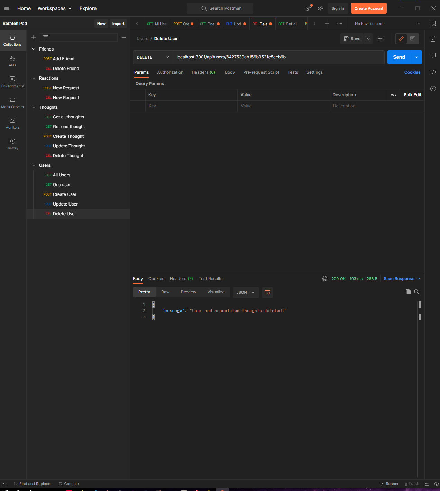
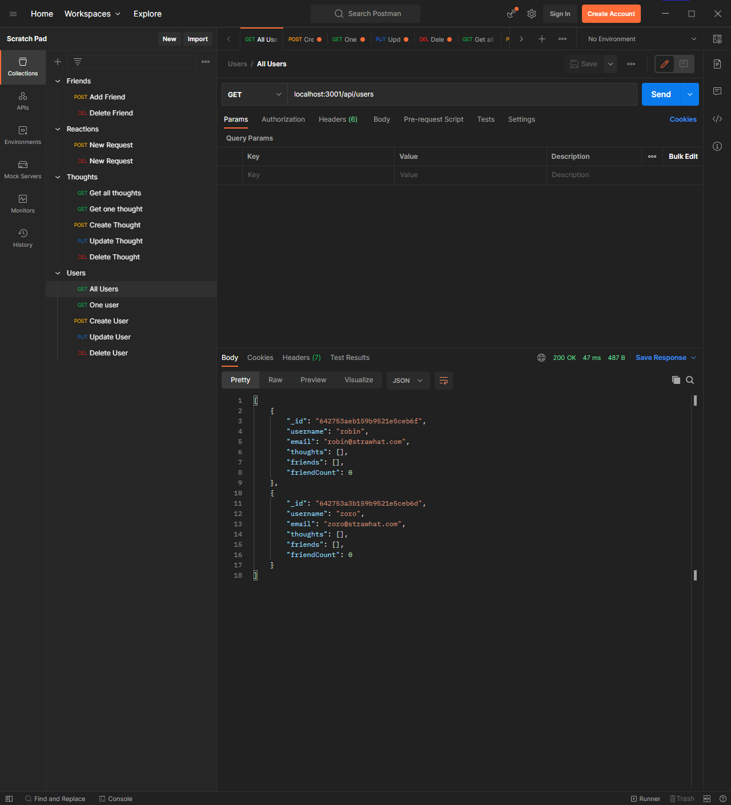

# Social-Network-API

## Description
This is a Social Network API created by Joel John. You can use any API client to test this API. In my demo below I use Postman.

All routes are working and when you delete a user, their associated thoughts and reactions will also be deleted.

## Table of Contents
- [Description](#description)
- [Installation](#installation)
- [Usage](#usage)
- [Author](#author)
- [License](#license)

## Installation
In the terminal, run 'node server.js'
## Usage

## Author
Joel John
- [GitHub](https://github.com/jo3kr)

## License
 MIT License

Copyright &copy; 2022 jo3kr &#127183;